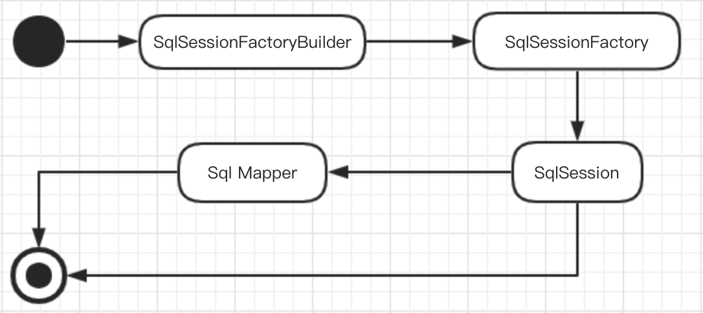
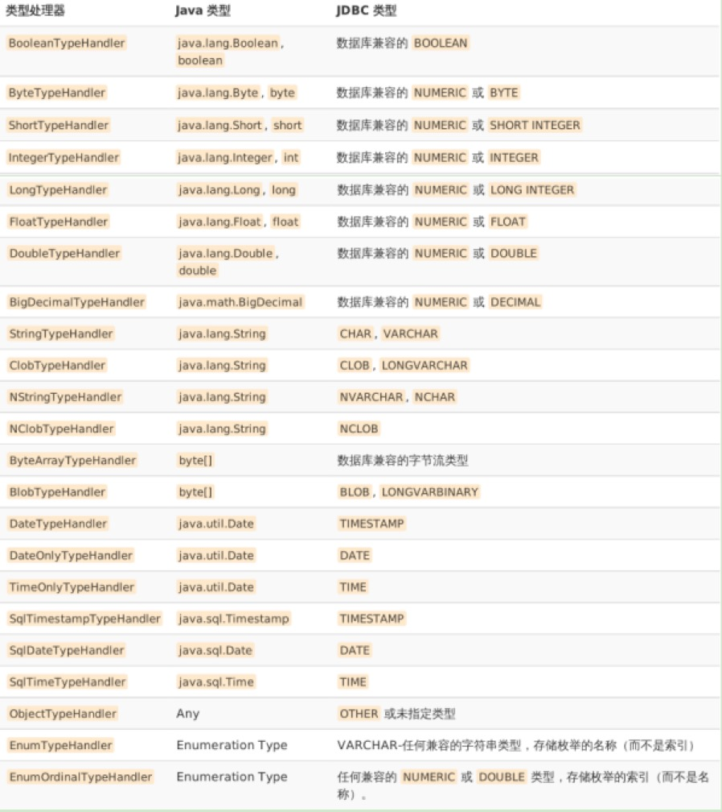

## Hibernate缺陷

​		Hibernate作为全表映射框架，举个例子来说，如果我们有张财务表（按年份分表），比如2015年表名为bill2015，到了2016年，表命名为bill2016，要动态加映射关系，Hibernate需要破坏底层封装才能做到。又比如说，一些财务信息往往需要和某些对象关联起来，不同的对象有不同的列，因此列名也是无法确定的，显然我们没有办法配置XML去完成映射规则。再者如果使用存储过程，Hibernate也是无法适应的。这些都不是致命的，最为致命的问题是性能。Hibernate屏蔽了SQL，那就意味着只能全表映射，但是一张表可能有几十到上百个字段，而你感兴趣的只有2个，这是Hibernate无法适应的。尤其是在大型网站系统，对传输数据有严格规定，不能浪费带宽的场景下就更为明显了。有很复杂的场景需要关联多张表，Hibernate全表逐级去对象的方法也只能作罢，写SQL还需要手工的映射去数据，这带来了很大的麻烦。此外，如果我们需要优化SQL，Hibernate也是无法做到的。

总结一下Hibernate的缺点：

- 全表映射带来的不便，比如更新时需要发送所有的字段。

- 取法根据不用的条件组装不同的SQL。

- 对夺标关联和复杂SQL查询支持较差，需要自己写SQL，返回后，需要自己将数据组装为POJO。
- 不能有效支持存储过程。

- 虽然有HQL，但是性能较差。大型互联网系统往往需要优化SQL，而Hibernate做不到。


## Mybatis

​		为了解决Hibernate的不足，一个半自动映射的框架mybatis应运而生。之所以称它为半自动，是因为它需要手工匹配提供POJO、SQL和映射关系，而全表映射的Hibernate只需要提供POJO和映射关系便可。

​		在Mybatis里面，你需要自己编写SQL，虽然比Hibernate配置得多，但是MyBatis可以配置动态SQL，这就解决了Hibernate的表名根据时间变化，不同的条件下列名不一样的问题。同时你也可以优化SQL，通过配置决定你的SQL映射规则，也能支持存储过程，所以对于一些复杂的和需要优化性能SQL的查询它更加方便，Mybatis几乎能做到JDBC所能做到的所有事情。MyBatis具有自动映射功能。换句话说，在注意一些规则的基础上，MyBatis可以给我们完成自动映射，而无需再写任何的映射规则，这大大提高了开发效率和灵活性。


### Mybastic主流程

Mybatis由以下几个核心组件构成：

- SqlSessionFactoryBuilder（构造器）：它会根据配置信息或者代码来生成SqlSessionFactory
- SqlSessionFactory（工厂接口）：依靠工厂来生成SqlSession。
- SqlSession（会话）：是一个既可以发送SQL去执行并返回结果，也可以获取Mapper的接口。
- SQL Mapper：它是Mybatis新设计的组件，它是由一个Java接口和XML文件（或注解）构造成的。需要给出对应的SQL和映射规则，它负责发送SQL去执行，并返回结果。

用一个图表达它们之间的关系：



主流程伪代码如下：

```java
// 1、获取配置文件
InputStream inputStream = Resources.getResourceAsStream("mybatis-config.xml");

// 2、根据配置文件加载SqlSessionFactory
SqlSessionFactory sqlSessionFactory = SqlSessionFactoryBuilder.build(inputStream);

// 3、获取Session
SqlSession session = sqlSessionFactory.openSession();

// 4.1、执行CURD
int resultCount = session.insert("com.whz.mapperinterface.IEmployeerMapper.addEmployeer", employeer );

// 4.2、使用Mapper接口：Mapper接口通过代理的方式，最终也是调用session执行CURD操作
IEmployeerMapper iEmployeerMapper = sqlSession.getMapper(IEmployeerMapper.class);
List<Employeer> employeers = iEmployeerMapper.findAllEmployeer();
```


###创建SqlSession流程


###SqlSessionFactoryBuilder

​		SqlSessionFactoryBuilder通过类名就可以看出这个类的主要作用就是创建一个SqlSessionFactory，SqlSessionFactory有两个实现类：DefaultSqlSessionFactory 和 SqlSessionManager。

​		SqlSessionFactoryBuilder创建的SqlSessionFactory都是使用DefaultSqlSessionFactory实现类，
它通过输入mybatis配置文件的字节流或者字符流生成XMLConfigBuilder，XMLConfigBuilder再创建一个Configuration，Configuration这个类中包含了mybatis的配置的一切信息，mybatis进行的所有操作都需要根据Configuration中的信息来进行。

​		SqlSessionFactoryBuilder可以被实例化、使用和丢弃，一旦创建了 SqlSessionFactory，就不再需要它了。 因此 SqlSessionFactoryBuilder 实例的最佳作用域是方法作用域（也就是局部方法变量）。 你可以重用 SqlSessionFactoryBuilder 来创建多个 SqlSessionFactory 实例，但是最好还是不要让其一直存在，以保证所有的 XML 解析资源可以被释放给更重要的事情。

```java
以下三个方法是SqlSessionFactoryBuilder的核心方法：
		/**
     * 资源文件可以使用 Reader 和 InputStream 两种形式返回，然后去解析
     *
     * @param reader            将配置文件包装为一个Reader对象，为后续解析做准备
     * @param environment       表示配置文件<environments default="development">中的default属性，用于指定当前的环境，比如：开发、测试或生产环境
     * @param properties        表示配置文件中的 <properties/> 标签，对应占位符参数
     * @return SqlSessionFactory 接口：该接口用于创建一个 SqlSession 对象
     */
    public SqlSessionFactory build(Reader reader, String environment, Properties properties) {
        try {
            XMLConfigBuilder parser = new XMLConfigBuilder(reader, environment, properties);
            return build(parser.parse());
        } catch (Exception e) {
            throw ExceptionFactory.wrapException("Error building SqlSession.", e);
        } finally {
            ErrorContext.instance().reset();
            try {
                reader.close();
            } catch (IOException e) {
                // Intentionally ignore. Prefer previous error.
            }
        }
    }

    /**
     * 类比 {@link SqlSessionFactoryBuilder#build(Reader, String, Properties)} 方法
     *
     * @param inputStream   Mybastic配置文件流
     * @param environment   表示配置文件<environments default="development">中的default属性，用于指定当前的环境，比如：开发、测试或生产环境
     * @param properties    表示配置文件中的 <properties/> 标签，对应占位符参数
     * @return
     */
    public SqlSessionFactory build(InputStream inputStream, String environment, Properties properties) {
        try {
            XMLConfigBuilder parser = new XMLConfigBuilder(inputStream, environment, properties);
            return build(parser.parse());
        } catch (Exception e) {
            throw ExceptionFactory.wrapException("Error building SqlSession.", e);
        } finally {
            ErrorContext.instance().reset();
            try {
                inputStream.close();
            } catch (IOException e) {
                // Intentionally ignore. Prefer previous error.
            }
        }
    }

    /**
     * 配置文件解析后再内存中保存为一个 Configuration 对象，该方法使用 Configuration 对象创建一个 DefaultSqlSessionFactory
     *
     * @param config        Mybastic配合
     * @return
     */
    public SqlSessionFactory build(Configuration config) {
        return new DefaultSqlSessionFactory(config);
    }
```


### SqlSessionFactory

​		SqlSessionFactory 一旦被创建就应该在应用的运行期间一直存在，没有任何理由丢弃它或重新创建另一个实例。 使用 SqlSessionFactory 的最佳实践是在应用运行期间不要重复创建多次，多次重建 SqlSessionFactory 被视为一种代码“坏味道（bad smell）”。因此 SqlSessionFactory 的最佳作用域是应用作用域。 有很多方法可以做到，最简单的就是使用单例模式或者静态单例模式。

​		SqlSessionFactory创建SqlSession实例时，可以从已有连接对象Connection创建会话，也可以使用数据源创建会话：

1、当使用数据源创建会话时，需要指定事务隔离级别和是否自动提交。

 *      1.1 事务隔离级别可以不要用设置，当不设置的情况下，底层会根据不同的数据库厂商，自动设置默认的隔离级别
 *      1.2 是否自动提交在Mybastic中统一默认为否，实际的JDBC会依赖不同的数据库厂商实现

2、当使用连接对象创建会话时，此时不需要指定事务隔离级别和是否自动提交，因为创建连接实例时就已经指定了（创建数据库连接的底层实现也是根据数据源来创建的）

```java
// 创建一个SqlSession实例：
// 如果入参没有指定执行器类型，默认使用的执行器类型是：ExecutorType.SIMPLE
// 创建session时，需要创建一个事务实例，此时需要指定：TransactionIsolationLevel（事务隔离级别）和autoCommit（是否自动提交）
public interface SqlSessionFactory {
    /**
     * 根据数据源创建一个会话
     *
     * @return
     */
    SqlSession openSession();

    /**
     * 根据数据源创建一个会话，并指定是否自动提交
     *
     * @param autoCommit    是否自动提交事务，是否自动提交在Mybastic中统一默认为否
     * @return
     */
    SqlSession openSession(boolean autoCommit);

    /**
     * 从已存在的数据库连接实例，创建一个会话
     *
     * @param connection
     * @return
     */
    SqlSession openSession(Connection connection);

    /**
     * 根据事务隔离级别创建一个会话，默认使用的执行器类型是：ExecutorType.SIMPLE，默认设置为不自动提交
     *
     * @param level     事务隔离级别
     * @return
     */
    SqlSession openSession(TransactionIsolationLevel level);

    /**
     * 根据数据源创建一个会话
     *
     * @return
     */
    SqlSession openSession(ExecutorType execType);

    /**
     * 根据数据源创建一个会话
     *
     * @param execType      执行器类型
     * @param autoCommit    是否自动提交事务，是否自动提交在Mybastic中统一默认为否
     * @return
     */
    SqlSession openSession(ExecutorType execType, boolean autoCommit);

    /**
     * 根据数据源创建一个会话
     *
     * @return
     */
    SqlSession openSession(ExecutorType execType, TransactionIsolationLevel level);

    /**
     * 从已存在的数据库连接实例，创建一个会话
     *
     * @param connection
     * @return
     */
    SqlSession openSession(ExecutorType execType, Connection connection);

    /**
     * 获取Mybastic配置
     *
     * @return
     */
    Configuration getConfiguration();
```


###SqlSession

​		每个线程都应该有它自己的 SqlSession 实例。SqlSession 的实例不是线程安全的，因此是不能被共享的，所以它的最佳的作用域是请求或方法作用域。 绝对不能将 SqlSession 实例的引用放在一个类的静态域，甚至一个类的实例变量也不行。 也绝不能将 SqlSession 实例的引用放在任何类型的托管作用域中，比如 Servlet 框架中的 HttpSession。 如果你现在正在使用一种 Web 框架，要考虑 SqlSession 放在一个和 HTTP 请求对象相似的作用域中。 换句话说，每次收到的 HTTP 请求，就可以打开一个 SqlSession，返回一个响应，就关闭它。 这个关闭操作是很重要的，你应该把这个关闭操作放到 finally 块中以确保每次都能执行关闭。 下面的示例就是一个确保 SqlSession 关闭的标准模式：

```java
try (SqlSession session = sqlSessionFactory.openSession()) {
  // 你的应用逻辑代码
}
```

在你的所有的代码中一致地使用这种模式来保证所有数据库资源都能被正确地关闭。


SqlSession接口可以简单分为以下几大类方法：

- CURD接口，所有的接口方法都需要mybastic中的执行语句id
- commit/rollback方法
- 获取配置对象Configuration方法
- 根据Class获取Mapper接口的方法
- 获取数据库连接对象的方法

SqlSession接口对应的源码如下：

```java
/**
 * Mapper执行的过程是通过Executor、StatementHandler、ParameterHandler和ResultHandler来完成数据库操作和结果返回。
 *
 * Executor代表执行，由它来调用StatementHandler、ParameterHandler、ResultHandler等来执行对应的SQL
 * StatementHandler的作用是使用数据库的Statement(PreparedStatement)执行操作，它是四大对象的核心，起到承上启下的作用。
 * ParameterHandler：用于SQL对参数的处理
 * ResultHandler：是进行最后数据集（ResultSet）的封装返回处理的
 *
 * @author Clinton Begin
 */
public interface SqlSession extends Closeable {

    // 声明：所有的入参statement表示select、insert、update、delete的语句的id，或者Mapper接口及对应的方法名

    <T> T selectOne(String statement);
    <T> T selectOne(String statement, Object parameter);

    <E> List<E> selectList(String statement);
    <E> List<E> selectList(String statement, Object parameter);
    <E> List<E> selectList(String statement, Object parameter, RowBounds rowBounds);

    <K, V> Map<K, V> selectMap(String statement, String mapKey);
    <K, V> Map<K, V> selectMap(String statement, Object parameter, String mapKey);
    <K, V> Map<K, V> selectMap(String statement, Object parameter, String mapKey, RowBounds rowBounds);

    <T> Cursor<T> selectCursor(String statement);
    <T> Cursor<T> selectCursor(String statement, Object parameter);
    <T> Cursor<T> selectCursor(String statement, Object parameter, RowBounds rowBounds);

    void select(String statement, Object parameter, ResultHandler handler);
    void select(String statement, ResultHandler handler);
    void select(String statement, Object parameter, RowBounds rowBounds, ResultHandler handler);

    int insert(String statement);
    int insert(String statement, Object parameter);

    int update(String statement);
    int update(String statement, Object parameter);

    int delete(String statement);
    int delete(String statement, Object parameter);

    void commit();
    void commit(boolean force);
    void rollback();
    void rollback(boolean force);


    /**
     * 清空Statement实例：
     * 比如，批量执行器，则会将多个Statement实例缓存起来，在该方法中一起执行，执行完成后则关闭和清空相关的Statement实例；
     * 再比如，复用执行器，会将执行过的Statement实例缓存起来，方便下次在里利用；
     *
     * @return
     */
    List<BatchResult> flushStatements();

    /**
     * 关闭session
     */
    @Override
    void close();

    /**
     * 清除session缓存（mybatis一级缓存）
     */
    void clearCache();

    /**
     * Retrieves current configuration
     *
     * @return
     */
    Configuration getConfiguration();

    /**
     * 根据 type 获取Mapper接口
     *
     * @param type
     * @param <T>
     * @return
     */
    <T> T getMapper(Class<T> type);

    /**
     * Retrieves inner database connection
     *
     * @return
     */
    Connection getConnection();
}
```


###映射器：Mapper

​		映射器是一些由你创建的、绑定你映射的语句的接口。映射器接口的实例是从 SqlSession 中获得的。因此从技术层面讲，任何映射器实例的最大作用域是和请求它们的 SqlSession 相同的。尽管如此，映射器实例的最佳作用域是方法作用域。 也就是说，映射器实例应该在调用它们的方法中被请求，用过之后即可丢弃。 并不需要显式地关闭映射器实例，尽管在整个请求作用域保持映射器实例也不会有什么问题，但是你很快会发现，像 SqlSession 一样，在这个作用域上管理太多的资源的话会难于控制。 为了避免这种复杂性，最好把映射器放在方法作用域内。下面的示例就展示了这个实践：

```java
try (SqlSession session = sqlSessionFactory.openSession()) {
  BlogMapper mapper = session.getMapper(BlogMapper.class);
  // 你的应用逻辑代码
}
```

​		映射器Mapper通过代理的方式，将CURD、事务commit/rollback操作交给了SqlSession实例，并且Mapper封装了事务相关的逻辑，Mapper仅关注于具体时间执行的SQL。


### 执行器：Executor

​		Mybastic中执行器Executor起到了至关重要的作用。我们从它的接口源码定义可以看出，Mybastic中的缓存机制的实现就是在这层实现的，另外它还管理Statement批量处理或Statement复用过程用到的Statement实例，它内部通过委托给StatementHandler进行更底层操作。

在MyBatis中存在三种执行器。我们可以在配置文件进行配置。

* SIMPLE，简单执行，它是默认的执行器，对应SimpleExecutor实现；
* REUSE，是一种执行重用预处理语句，ReuseExecutor；
* BATCH，执行器重用语句和批量更新，它是针对批量专用的执行器，对应BatchExecutor实现；

在Mybastic中默认使用SimpleExecutor。另外，当开启二级缓存时，会使用CachingExecutor对执行器再次进行包装。

执行进行数据操作时，需要准备好：MappedStatement、parameter、rowBounds以及ResultHandler。


**三种执行器的区别**

​		REUSE 类型的执行器，这个执行器和 SimpleExecutor 其实是差不多的，它们的区别就在于，SimpleExecutor 底层使用 Statement 来执行sql，而 ReuseExecutor 是使用 PreparedStatement。

* SimpleExecutor：每执行一次update或select，就开启一个Statement对象，用完立刻关闭Statement对象，注意这里的强调的是开启和关闭的Statement的区别，在Mybastic中，虽然使用SimpleExecutor作为默认的执行器，但是其内部还是默认使用PreparedStatement预编译的方式执行SQL的。

* ReuseExecutor：执行update或select，以sql作为key查找Statement对象，存在就使用，不存在就创建，用完后，不关闭Statement对象，而是放置于Map<String, Statement>内，供下一次使用。简言之，就是重复使用Statement对象。

* BatchExecutor：执行update（没有select，JDBC批处理不支持select），将所有sql都添加到批处理中（addBatch()），等待统一执行（executeBatch()），它缓存了多个Statement对象，每个Statement对象都是addBatch()完毕后，等待逐一执行executeBatch()批处理。与JDBC批处理相同。

​		

执行器接口源码如下：

```java
/**
 * 执行器Executor起到了至关重要的作用。它是一个真正执行java和数据库交互的东西。在MyBatis中存在三种执行器。我们可以在配置文件进行配置。
 *
 * SIMPLE，简单执行，它是默认的执行器
 * REUSE，是一种执行重用预处理语句。
 * BATCH，执行器重用语句和批量更新，它是针对批量专用的执行器
 *
 *
 * 执行进行数据操作时，需要准备好：MappedStatement、parameter、rowBounds以及一个ResultHandler对象
 *
 * @author Clinton Begin
 */
public interface Executor {

    /** 表示一个null的查询结果 */
    ResultHandler NO_RESULT_HANDLER = null;

    // --------------------
    // Mybatis 的所有 更新、插入和删除 操作，最终都将调用该方法来操作数据库
    // --------------------

    int update(MappedStatement ms, Object parameter) throws SQLException;

    // --------------------
    // 查询方法最终调用以下三个方法的其中一个来操作数据库
    // --------------------

    <E> List<E> query(MappedStatement ms, Object parameter, RowBounds rowBounds, ResultHandler resultHandler, CacheKey cacheKey, BoundSql boundSql) throws SQLException;
    <E> List<E> query(MappedStatement ms, Object parameter, RowBounds rowBounds, ResultHandler resultHandler) throws SQLException;
    <E> Cursor<E> queryCursor(MappedStatement ms, Object parameter, RowBounds rowBounds) throws SQLException;


    /**
     * 清空Statement实例：
     * 比如，批量执行器，则会将多个Statement实例缓存起来，在该方法中一起执行，执行完成后则关闭和清空相关的Statement实例；
     * 再比如，复用执行器，会将执行过的Statement实例缓存起来，方便下次在里利用；
     *
     * @return
     * @throws SQLException
     */
    List<BatchResult> flushStatements() throws SQLException;

    /**
     * 提交事务：执行器的事务提交实现委托给了{@link Transaction}去实现，执行器层的事务提交是对Statement实例缓存和查询结果缓存做了一层封装，保证了事务提交前都能清楚Statement缓存和Mybastic的一级缓存
     *
     * @param required      是否执行事务提交操作
     * @throws SQLException
     */
    void commit(boolean required) throws SQLException;

    /**
     * 回滚事务：执行器的事务回滚实现委托给了{@link Transaction}去实现，执行器层的事务回滚是对Statement实例缓存和查询结果缓存做了一层封装，保证了事务回滚前都能清除Statement缓存和Mybastic的一级缓存
     *
     * @param required
     * @throws SQLException
     */
    void rollback(boolean required) throws SQLException;

    /**
     * 创建一个CacheKey对象
     *
     * @param ms                    MappedStatement
     * @param parameterObject       本次执行的参数
     * @param rowBounds             分页信息
     * @param boundSql              本次执行的SQL相关信息
     * @return
     */
    CacheKey createCacheKey(MappedStatement ms, Object parameterObject, RowBounds rowBounds, BoundSql boundSql);

    /**
     * 判断该缓存key是否存在缓存
     *
     * @param ms
     * @param key
     * @return
     */
    boolean isCached(MappedStatement ms, CacheKey key);

    /**
     * 用于清除会话缓存，当执行器执行更新操作前，会调用该方法清除会话缓存；也可以通过{@link SqlSession#clearCache()}方法手动清除缓存
     */
    void clearLocalCache();

    /**
     * 结果集处理器在每次处理执行结果的时候会来调该方法，缓存查询结果
     *
     * @param ms                本次执行MappedStatement
     * @param resultObject      结果集对应的MetaObject
     * @param property
     * @param key               缓存key
     * @param targetType
     */
    void deferLoad(MappedStatement ms, MetaObject resultObject, String property, CacheKey key, Class<?> targetType);

    /**
     * 获取一个事务实例
     *
     * @return
     */
    Transaction getTransaction();

    /**
     * 关闭执行器，会话关闭时会关闭对应的执行器
     *
     * @param forceRollback 关闭会话时，是否强制回滚事务，为false时，事务会默认提交
     */
    void close(boolean forceRollback);

    /**
     * 执行器是否已经关闭
     *
     * @return
     */
    boolean isClosed();

    /**
     * 设置保存执行器，{@link BatchExecutor}、{@link ReuseExecutor}和{@link SimpleExecutor}会调用该方法，一般设置的包装执行器是缓存执行器，缓存执行器在最外层
     *
     * @param executor
     */
    void setExecutorWrapper(Executor executor);

}
```


### StatementHandler

StatementHandler接口的实现有三种：

* SimpleStatementHandler：使用JDBC中的Statement实现来完成数据库操作
* PreparedStatementHandler：使用JDBC中的PreparedStatement实现来完成数据库操作
* CallableStatementHandler：使用JDBC中的CallableStatement实现来完成数据库操作

RoutingStatementHandler可以理解为工厂，Mybastic中都是通过该Handler来处理所有的SQL，它的内部委托给了以上三种Handler来处理SQL；


StatementHandler接口源码，从以下接口方法我可以看出，StatementHandler的作用是用来处理根据配置信息创建Statement实例、PreparedStatement类型的参数预处理，以及动态SQL和对返回的结果集进行进一步的封装：

```java
/**
 * StatementHandler 是对JDBC的 Statement 做进一步的封装，所有的数据库操作，最终其实都是由 java.sql.Statement 来完成的
 *
 * @author Clinton Begin
 */
public interface StatementHandler {

    /**
     * 根据数据库的连接实例创建一个Statement对象
     *
     * @param connection            数据库连接实例
     * @param transactionTimeout    事务超时时间
     * @return
     * @throws SQLException
     */
    Statement prepare(Connection connection, Integer transactionTimeout) throws SQLException;

    /**
     * 用来设置参数：
     * 因为当使用预编译时，一开始SQL编译的时候是不需要设置参数的，所以当要真正执行SQL时，需要设置参数；
     * 如果是使用 Statement 的方式，则该实现为空，因为Statement执行SQL的时候，参数就已经设置好了
     *
     * @param statement
     * @throws SQLException
     */
    void parameterize(Statement statement) throws SQLException;

    /**
     * 批处理的方式，JDBC仅支持批量新增、更新和删除操作，不支持批量查询
     *
     * @param statement
     * @throws SQLException
     */
    void batch(Statement statement) throws SQLException;

    /**
     * 执行更新操作时会调用给方法，这里的更新操作包括：insert、update和delete
     *
     * @param statement
     * @return 返回影响的行数
     * @throws SQLException
     */
    int update(Statement statement) throws SQLException;

    /**
     * 执行查询
     *
     * @param statement
     * @param resultHandler
     * @param <E>
     * @return
     * @throws SQLException
     */
    <E> List<E> query(Statement statement, ResultHandler resultHandler) throws SQLException;

    /**
     * 执行查询，并以游标的方式返回结果集
     *
     * @param statement
     * @param <E>
     * @return
     * @throws SQLException
     */
    <E> Cursor<E> queryCursor(Statement statement) throws SQLException;

    /**
     * 获取本次要执行的SQL相关信息
     *
     * @return
     */
    BoundSql getBoundSql();

    /**
     * 获取参数处理器，用于设置{@code PreparedStatement}的参数
     *
     * @return
     */
    ParameterHandler getParameterHandler();

}
```


###Key生成器：KeyGenerator

​	当mybatis中<setting> 设置了允许 JDBC 支持自动生成主键，会创建KeyGenerator接口的一个实例，在平时开发的时候经常会有这样的需求，插入数据返回主键，或者插入数据之前需要获取主键，这样的需求在 mybatis 中也是支持的，其中主要的逻辑部分就在 KeyGenerator 中，下面是他的几种实现：

* NoKeyGenerator：默认空实现，不需要对主键单独处理；
* Jdbc3KeyGenerator：主要用于数据库的自增主键，比如 MySQL、PostgreSQL；
* SelectKeyGenerator：主要用于数据库不支持自增主键的情况，比如 Oracle、DB2；

Oracle不支持主键自增，因为oracle不存在mysql的自增方法auto_increment，所以在Oracle中要实现字段的自增需要使用序列和触发器来实现字段的自增。


SelectKeyGenerator：主要是通过 XML 配置或者注解设置 selectKey ，然后单独发出查询语句，在返回拦截方法中使用反射设置主键，其中两个拦截方法只能使用其一，默认 使用 processBefore，在 selectKey.order 属性中设置 AFTER|BEFORE 来确定；


###问题

mybastic使用DOM的方式解析xml配置文件；


##Mybastic配置

以下是Mybatis配置XML文件的层次结构：

```xml
<?xml version="1.0" encoding="UTF-8" ?>
<configuration>
   <properties/><!--属性-->
   <settings/><!--设置-->
   <typeAliases/><!--类型命名-->
   <typeHandlers/><!--类型处理器-->
   <objectFactory/><!--对象工厂-->
   <plugins/><!--插件-->
   <environments><!--配置环境-->
      <environment>
         <transactionManager/><!--事务管理器-->
         <dataSource/><!--数据源-->
      </environment>
   </environments>
   <databaseIdProvider/><!--数据库厂商标识-->
   <mappers/><!--映射器-->
</configuration>
```

**注意，这些层次是不能颠倒顺序的，如果颠倒顺序，mybatis在解析XML文件的时候会出现异常。**


###1. \<properties/>

​		properties是一个配置属性的元素，能让我们在配置文件的上下中使用配置的属性，Mybatis提供了3种配置方式：

* Xml配置
* .properties文件配置
* 程序参数传递

####Xml配置

使用子元素配置的方式如下：

```xml
<properties>
   <property name="driver" value="com.mysql.jdbc.Driver"/>
   <property name="url" value="jdbc:mysql://localhost:3306/test?useUnicode=true&amp;characterEncoding=utf-8"/>
   <property name="username" value="root"/>
   <property name="password" value="123456"/>
</properties>
```

这样我们就可以使用${}占位符的形式使用这些属性，如：

```xml
<dataSource type="POOLED">
   <property name="driver" value="${driver}" />
   <property name="url" value="${url}" />
   <property name="username" value="${username}" />
   <property name="password" value="${password}" />
</dataSource>
```


####.properties配置

​		我们也可以使用使用properties配置文件来配置属性值，以方便在多个配置文件中重复使用它们，也方便日后维护修改，我们将上面的数据源信息配置在.properties文件中，如：

```properties
#数据库配置信息
driver=com.mysql.jdbc.Driver
url=jdbc:mysql://localhost:3306/test?useUnicode=true&characterEncoding=utf-8
username=root
password=123456
```

 

####程序参数传递

​		在实际工作中，系统是有运维人员去配置的，生成数据库的用户密码对于开发者而言是保密的，而且为了安全，运维人员要求对配置文件中的数据库用户和密码进行加密，这样我们的配置文件中往往配置的加密过后的数据库信息，而无法通过加密字符串去连接数据库，这个时候可以通过编码的形式来满足我们遇到的场景。

​		下面假设jdbc.properties文件中的username和password两个属性使用了加密的字符串，这个时候我们需要在生成SQLSessionFactory之前将它转化为明文，而系统已经提供了解密的方法decode(Str），以下是使用代码的方式来完成SQLSessionFactory的创建：

```java
InputStream cfgStream = null;
Reader cfgReader = null;
InputStream proStream = null;
Reader proReader = null;
Properties properties = null;
try{

   // 读取配置文件
   cfgSteam = Resources.getReasourceAsStream("mybatis-config.xml");
   cfgReader = new InputStreamReader(cfgStream);
   // 读入属性文件
   proStream = new inputStreamReader(proStream);
   properties = new Properties();
   proerties.load(proRdader);
   // 解密为明文
   properties.setProperty("username",decode(properties.getProperty("username")));
   properties.setProperty("password",decode(properties.getProperty("password")));
} catch(IOException ex){}

// 创建SqlSessionFactory
sqlSessionFactory = new SqlSessionFactoryBuilder().build(cfg,Reader, properties);
```

 

####三种配置方式的优先级

如果属性在不只一个地方进行了配置，那么MyBatis 将按照下面的顺序来加载：

* Mybastic中setting标签对应的properties 元素体内指定的属性首先被读取。

* 然后根据properties 元素中的resource 属性读取类路径下属性文件或根据url 属性指定的路径读取属性文件，并覆盖已读取的同名属性。

* 最后读取作为方法参数传递的属性，并覆盖已读取的同名属性。

​		因此，**通过方法参数传递的属性具有最高优先级，resource/url 属性中指定的配置文件次之，最低优先级的是Mybastic配置中的setting标签对应的properties属性中指定的属性。实际操作中我们推荐使用.properties文件的方式，尽量避免使用混合的方式。**

**优先级：**参数传递 > .properties文件 > Mybastic的xml配置


###2. \<settings/>

​		这是MyBatis 中极为重要的调整设置，它们会改变MyBatis 的运行时行为。下表描述了设置中各项的意图、默认值等。

| **设置参数**                      | **描述**                                                     | **有效值**                                                   | **默认值**                                            |
| --------------------------------- | ------------------------------------------------------------ | ------------------------------------------------------------ | ----------------------------------------------------- |
| cacheEnabled                      | 该配置影响的所有映射器中配置的缓存的全局开关。               | true \| false                                                | true                                                  |
| lazyLoadingEnabled                | 延迟加载的全局开关。当开启时，所有关联对象都会延迟加载。 特定关联关系中可通过设置fetchType属性来覆盖该项的开关状态。 | true \| false                                                | false                                                 |
| aggressiveLazyLoading             | 当开启时，任何方法的调用都会加载该对象的所有属性。否则，每个属性会按需加载（参考lazyLoadTriggerMethods). | true \| false                                                | false (true in ≤3.4.1)                                |
| multipleResultSetsEnabled         | 是否允许单一语句返回多结果集（需要兼容驱动）。               | true \| false                                                | true                                                  |
| useColumnLabel                    | 使用列标签代替列名。不同的驱动在这方面会有不同的表现， 具体可参考相关驱动文档或通过测试这两种不同的模式来观察所用驱动的结果。 | true \| false                                                | true                                                  |
| useGeneratedKeys                  | 允许 JDBC 支持自动生成主键，需要驱动兼容。 如果设置为 true 则这个设置强制使用自动生成主键，尽管一些驱动不能兼容但仍可正常工作（比如 Derby）。 | true \| false                                                | False                                                 |
| autoMappingBehavior               | 指定 MyBatis 应如何自动映射列到字段或属性。 NONE 表示取消自动映射；PARTIAL 只会自动映射没有定义嵌套结果集映射的结果集。 FULL 会自动映射任意复杂的结果集（无论是否嵌套）。 | NONE, PARTIAL, FULL                                          | PARTIAL                                               |
| autoMapping-UnknownColumnBehavior | 指定发现自动映射目标未知列（或者未知属性类型）的行为。 NONE: 不做任何反应 WARNING: 输出提醒日志('org.apache.ibatis.session.AutoMappingUnknownColumnBehavior' 的日志等级必须设置为 WARN) FAILING: 映射失败 (抛出 SqlSessionException) | NONE, WARNING, FAILING                                       | NONE                                                  |
| defaultExecutorType               | 配置默认的执行器。SIMPLE 就是普通的执行器；REUSE 执行器会重用预处理语句（prepared statements）； BATCH 执行器将重用语句并执行批量更新。 | SIMPLE REUSE BATCH                                           | SIMPLE                                                |
| defaultStatementTimeout           | 设置超时时间，它决定驱动等待数据库响应的秒数。               | 任意正整数                                                   | Not Set (null)                                        |
| defaultFetchSize                  | 为驱动的结果集获取数量（fetchSize）设置一个提示值。此参数只可以在查询设置中被覆盖。 | 任意正整数                                                   | Not Set (null)                                        |
| safeRowBoundsEnabled              | 允许在嵌套语句中使用分页（RowBounds）。 If allow, set the false. | true \| false                                                | False                                                 |
| safeResultHandlerEnabled          | 允许在嵌套语句中使用分页（ResultHandler）。 If allow, set the false. | true \| false                                                | True                                                  |
| mapUnderscoreToCamelCase          | 是否开启自动驼峰命名规则（camel case）映射，即从经典数据库列名 A_COLUMN 到经典 Java 属性名 aColumn 的类似映射。 | true \| false                                                | False                                                 |
| localCacheScope                   | MyBatis 利用本地缓存机制（Local Cache）防止循环引用（circular references）和加速重复嵌套查询。 默认值为SESSION，这种情况下会缓存一个会话中执行的所有查询。 若设置值为 STATEMENT，本地会话仅用在语句执行上，对相同 SqlSession 的不同调用将不会共享数据。 | SESSION \| STATEMENT                                         | SESSION                                               |
| jdbcTypeForNull                   | 当没有为参数提供特定的 JDBC 类型时，为空值指定 JDBC 类型。 某些驱动需要指定列的 JDBC 类型，多数情况直接用一般类型即可，比如 NULL、VARCHAR 或 OTHER。 | JdbcType enumeration. Most common are: NULL, VARCHAR and OTHER | OTHER                                                 |
| lazyLoadTriggerMethods            | 指定哪个对象的方法触发一次延迟加载。                         | A method name list separated by commas                       | equals,clone,hashCode,toString                        |
| defaultScriptingLanguage          | 指定动态 SQL 生成的默认语言。                                | A type alias or fully qualified class name.                  | org.apache.ibatis.scripting.xmltags.XMLLanguageDriver |
| callSettersOnNulls                | 指定当结果集中值为 null 的时候是否调用映射对象的setter（map 对象时为 put）方法，这对于有 Map.keySet() 依赖或 null 值初始化的时候是有用的。注意基本类型（int、boolean等）是不能设置成 null 的。 | true \| false                                                | false                                                 |
| returnInstanceForEmptyRow         | 当返回行的所有列都是空时，MyBatis默认返回null。 当开启这个设置时，MyBatis会返回一个空实例。 请注意，它也适用于嵌套的结果集 (i.e. collectioin and association)。（从3.4.2开始） | true \| false                                                | false                                                 |
| logPrefix                         | 指定 MyBatis 增加到日志名称的前缀。                          | Any String                                                   | Not set                                               |
| logImpl                           | 指定 MyBatis 所用日志的具体实现，未指定时将自动查找。        | SLF4J \| LOG4J \| LOG4J2 \| JDK_LOGGING \| COMMONS_LOGGING \| STDOUT_LOGGING \| NO_LOGGING | Not set                                               |
| proxyFactory                      | 指定 Mybatis 创建具有延迟加载能力的对象所用到的代理工具。    | CGLIB \| JAVASSIST                                           | JAVASSIST (MyBatis 3.3 or above)                      |
| vfsImpl                           | 指定VFS的实现                                                | 自定义VFS的实现的类全限定名，以逗号分隔。                    | Not set                                               |
| useActualParamName                | 允许使用方法签名中的名称作为语句参数名称。 为了使用该特性，你的工程必须采用Java 8编译，并且加上-parameters选项。（从3.4.1开始） | true \| false                                                | true                                                  |
| configurationFactory              | Specifies the class that provides an instance of Configuration. The returned Configuration instance is used to load lazy properties of deserialized objects. This class must have a method with a signature static Configuration getConfiguration(). (Since: 3.2.3) | A type alias or fully qualified class name.                  | Not set                                               |

 

settings标签的配置示例如下：

```xml
<settings>
    <setting name="cacheEnabled" value="true"/>
    <setting name="lazyLoadingEnabled" value="true"/>
    <setting name="multipleResultSetsEnabled" value="true"/>
    <setting name="useColumnLabel" value="true"/>
    <setting name="useGeneratedKeys" value="false"/>
    <setting name="autoMappingBehavior" value="PARTIAL"/>
    <setting name="autoMappingUnknownColumnBehavior" value="WARNING"/>
    <setting name="defaultExecutorType" value="SIMPLE"/>
    <setting name="defaultStatementTimeout" value="25"/>
    <setting name="defaultFetchSize" value="100"/>
    <setting name="safeRowBoundsEnabled" value="false"/>
    <setting name="mapUnderscoreToCamelCase" value="false"/>
    <setting name="localCacheScope" value="SESSION"/>
    <setting name="jdbcTypeForNull" value="OTHER"/>
    <setting name="lazyLoadTriggerMethods" value="equals,clone,hashCode,toString"/>
</settings>
```


###3. \<typeAliases/>

​		别名是一个指代的名称。因为有时候我们遇到的类权限定名过长，所以我们希望使用一个简短的名称去指代它，而这个名称可以在mybatis上下文中使用。类型别名是为 Java 类型设置一个短的名字。 它只和 XML 配置有关，存在的意义仅在于用来减少类完全限定名的冗余。例如：

```xml
<typeAliases>
  <typeAlias alias="Author" type="domain.blog.Author"/>
  <typeAlias alias="Blog" type="domain.blog.Blog"/>
  <typeAlias alias="Comment" type="domain.blog.Comment"/>
  <typeAlias alias="Post" type="domain.blog.Post"/>
  <typeAlias alias="Section" type="domain.blog.Section"/>
  <typeAlias alias="Tag" type="domain.blog.Tag"/>
</typeAliases>
```

当这样配置时，`Blog` 可以用在任何使用 `domain.blog.Blog` 的地方。

**包路径扫描指定java bean别名：**

也可以指定一个包名，MyBatis 会在包名下面搜索需要的 Java Bean，比如：

```xml
<typeAliases>
  <package name="domain.blog"/>
</typeAliases>
```

**注解指定别名：**

每一个在包 `domain.blog` 中的 Java Bean，在没有注解的情况下，会使用 Bean 的首字母小写的非限定类名来作为它的别名。 比如 `domain.blog.Author` 的别名为 `author`；若有注解，则别名为其注解值。见下面的例子：

```java
@Alias("author")
public class Author {
    ...
}
```

这是一些为常见的 Java 类型内建的相应的类型别名。它们都是不区分大小写的，注意对基本类型名称重复采取的特殊命名风格。


别名在Mybatis中分为系统别名和自定义别名两类。**注意，别名是不区分大小写的。**

####系统别名

​		Mybatis系统定义了一些经常使用的类型的别名，例如，数值、字符串、日期和集合等，我们可以在Mybatis中直接使用它们，在使用时不要重复定义把它们给覆盖了。以下是Mybatis已经定义好的别名，支持数值类型的只要加“[]”即可使用，比如Date数组别名可以使用date[]代替。

| **别名**   | **映射的类型** |
| ---------- | -------------- |
| _byte      | byte           |
| _long      | long           |
| _short     | short          |
| _int       | int            |
| _integer   | int            |
| _double    | double         |
| _float     | float          |
| _boolean   | boolean        |
| string     | String         |
| byte       | Byte           |
| long       | Long           |
| short      | Short          |
| int        | Integer        |
| integer    | Integer        |
| double     | Double         |
| float      | Float          |
| boolean    | Boolean        |
| date       | Date           |
| decimal    | BigDecimal     |
| bigdecimal | BigDecimal     |
| object     | Object         |
| map        | Map            |
| hashmap    | HashMap        |
| list       | List           |
| arraylist  | ArrayList      |
| collection | Collection     |
| iterator   | Iterator       |


####自定义别名

​		系统定义的别名往往是不够用的，因为不同的应用有着不同的需要，所以Mybatis允许自定义别名。如：

```xml
<typeAliases>
   <typeAlias alias="employeer" type="com.whz.entity.Employeer" />
</typeAliases>
```

这样employee可以在任何需要使用com.whz.entity.Employee的地方去提换它，如：

```xml
<select id="findEmployeerByID" parameterType="int" resultType="employeer">
    select * from `t_employeer` where employeer_id = #{employeer_id}
</select>
```

 

也可以使用@Alias注解来定义别名，如：

```java
@Alias("employeer")
public class Employeer {
   ...
}
```

如果POJO过多的时候，配置也会非常多，Mybatis为解决该问题，支持使用自动扫描包的功能，将扫描到的类装载到上下文中，如：

```xml
<typeAliases>
   <package name="com.whz.entity"/>
</typeAliases>
```

注意，配置了包扫描功能后，**没有@Alias的也会装载，Mybatis将把你的类名的第一个字母变为小写来作为别名**，所以需要特别注意避免出现重名的场景，建议使用部分包名加类名的限定。


###4. \<typeHandlers/>

​		Mybatis在预处理语句（PreparedStatement）中设置一个参数时，或从结果集（ResultSet）中取出一个值时，都会用到typeHandler进行处理。typeHandler的作用就是将参数从JavaType转为jdbcType，或者从数据库取出结果时把jdbcType转为JavaType。

​		由于数据库可能来自于不同的厂商，不同的厂商设置的参数可能所有不同，同时数据库也可以自定义数据类型，typeHandler允许根据项目的需要自定义设置Java传递到数据库的参数中，或者从数据库读出数据，我们也需要进行特殊的处理，这些都可以在定义的typeHandler中处理，尤其是在使用枚举的时候我们常常需要使用typeHandler进行转换。

​		typeHandler也分为系统和用于自定义两种，一般来说，使用Mybatis系统定义的typeHandler就可以实现大部分的功能。


####1. 系统定义的typeHandler




####2. 用户定义的typeHandler


#####2.1 需求背景

​		在做开发时，我们经常会遇到这样一些问题，比如我有一个[Java](http://lib.csdn.net/base/java)中的Date数据类型，我想将之存到[数据库](http://lib.csdn.net/base/mysql)的时候存成一个1970年至今的毫秒数，怎么实现？

假设我现在创建一张表，如下： 

```sql
create table user(
 id integer primary key auto_increment,
 username varchar(32),
 password varchar(64),
 regTime varchar(64)
)default character set=utf8;
```

然后我再在Java中定义一个实体类：

```java
public class User {
   private Long id;
   private String username;
   private String password;
   private Date regTime;
   //省略getter/setter
}
```

这个JavaBean中也有一个regTime字段，不同的是这里的数据类型是Date。如果我不做任何特殊处理，直接向数据库插入数据，也是可以插入成功的，但是插入成功后是这样： 


这个当然不是我想要的，我希望存到数据库里的是这样的： 


就是我直接向数据库写数据，要写的是一个Date对象，但是写到数据库之后这个Date对象就变成了Date对象所描述的时间到1970年的秒数了，然后当我从数据库读取这个秒数之后，系统又会自动帮我将这个秒数转为Date对象，就是这样两个需求。


#####2.2 自定义typeHandler

​		这个时候，我们要做的事情其实很简单，那就是自定义typeHandler，自定义typeHandler我们有两种方式，一种是实现TypeHandler接口，还有一种简化的写法就是继承自BaseTypeHandler类，我这里先以第二种为例来进行说明。

```java
@MappedJdbcTypes({JdbcType.VARCHAR})
@MappedTypes({Date.class})
public class MyDateTypeHandler extends BaseTypeHandler<Date> {

    public void setNonNullParameter(PreparedStatement preparedStatement, int i, Date date, JdbcType jdbcType) throws SQLException {
        preparedStatement.setString(i, String.valueOf(date.getTime()));
    }

    public Date getNullableResult(ResultSet resultSet, String s) throws SQLException {
        return new Date(resultSet.getLong(s));
    }

    public Date getNullableResult(ResultSet resultSet, int i) throws SQLException {
        return new Date(resultSet.getLong(i));
    }

    public Date getNullableResult(CallableStatement callableStatement, int i) throws SQLException {
        return callableStatement.getDate(i);
    }

}
```

**关于这个类我说如下几点：**

1．@MappedJdbcTypes定义的是JdbcType类型，这里的类型不可自己随意定义，必须要是枚举类org.apache.ibatis.type.JdbcType所枚举的数据类型。 

2．@MappedTypes定义的是JavaType的数据类型，描述了哪些Java类型可被拦截。 

3．在我们启用了我们自定义的这个TypeHandler之后，数据的读写都会被这个类所过滤 

4．在setNonNullParameter方法中，我们重新定义要写往数据库的数据。 

5．在另外三个方法中我们将从数据库读出的数据类型进行转换。


#####2.3 注册typeHandler

我们需要在我们的mybatis配置文件中注册typeHandler，注册有两种不同的方式，可以像下面这样一个类一个类的注册：

```xml
<typeHandlers>
   <typeHandler handler="com.whz.MyDateTypeHandler"/>
</typeHandlers>
```

也可以直接注册一个包中所有的typeHandler，系统在启动时会自动扫描包下的所有文件，如下：

```xml
<typeHandlers>
   <package name="com.whz"/>
</typeHandlers>
```

这样配置完成之后，我们的目的就达到了，当我们进行数据库的读取操作的时候，秒数就会自动转为Date对象。


##### 2.4 查询时将jdbcType转为JavaType

```xml
<resultMap id="userResultMap" type="org.sang.bean.User">
   <result typeHandler="org.sang.db.MyDateTypeHandler" column="regTime" jdbcType="VARCHAR"
         property="regTime" javaType="java.util.Date"/>
</resultMap>

<select id="getUser" resultMap="userResultMap">
   select * from user
</select>
```

 

##### 2.5 插入时将JavaType转为jdbcType

```xml
<!--方法一：-->
<insert id="insertUser1" parameterType="org.sang.bean.User">
   INSERT INTO user4(username,password,regTime)
   VALUES (#{username},#{password},#{regTime,javaType=Date,jdbcType=VARCHAR,typeHandler=org.sang.db.MyDateTypeHandler})
</insert>

<!--方法二：-->
<insert id="insertUser2">
   INSERT INTO user4(username,password,regTime)
   VALUES (#{username},#{password},#{regTime,javaType=Date,jdbcType=VARCHAR})
</insert>

<!--方法三：-->
<insert id="insertUser3">
   INSERT INTO user4(username,password,regTime)
   VALUES (#{username},#{password},#{regTime,typeHandler=org.sang.db.MyDateTypeHandler})
</insert>
```

这三种效果都是一样的，都是在插入的时候将数据Date对象转为秒数。

 

 

####3. 枚举类型typeHandler

​		在Java中，我们经常使用枚举类型来对一些字段进行建模，比如性别，然而在数据库中，我们通常将性别字段设置为tinyint等类型，这时我们就需要使用到枚举类型的typeHandler，关于这个的使用示例，在网上一大堆，我就不举例了。


###4. \<objectFactory/>

​		MyBatis每次创建结果对象的新实例时，它都会使用一个对象工厂（ObjectFactory）实例来完成。 默认的对象工厂需要做的仅仅是实例化目标类，要么通过默认构造方法，要么在参数映射存在的时候通过参数构造方法来实例化。在大部分场景下我们都不用修改，如果想覆盖对象工厂的默认行为，则可以通过创建自己的对象工厂并添加相应的配置即可。

```java
public class ExampleObjectFactory extends DefaultObjectFactory {

    @Override  
    public Object create(Class type) {
        if(type.equals(User.class)){
            User user = (User)super.create(type);  
            // 这里可做一些操作
            return user;  
        }  
        return super.create(type);
    }
    
    @Override  
    public void setProperties(Properties properties) {
        Iterator iterator= properties.keySet().iterator();
        while(iterator.hasNext()){  
            //迭代器 输出配置文件定义的数据  
            String value = String.valueOf(iterator.next());  
            System.out.println(properties.getProperty(value));  
        }  
        //传入property  
        super.setProperties(properties);  
    }  

    @Override  
    public <T> boolean isCollection(Class<T> type) {
        return Connection.class.isAssignableFrom(type);
    }  

}
```


**\<objectFactory>配置**

```xml
<objectFactory type="com.whz.ExampleObjectFactory">
   <property name="someProperty" value="100"/>
</objectFactory>
```

 ObjectFactory接口很简单，它包含两个创建用的方法，一个是处理默认构造方法的，另外一个是处理带参数的构造方法的。 最后，setProperties方法可以被用来配置ObjectFactory，在初始化你的ObjectFactory 实例后，objectFactory 元素体中定义的属性会被传递给setProperties 方法。

 

###5. \<plugins/>

​		MyBatis 允许你在已映射语句执行过程中的某一点进行拦截调用。默认情况下，MyBatis 允许使用插件来拦截的方法调用包括：

- Executor (update, query, flushStatements, commit, rollback, getTransaction, close, isClosed)
- ParameterHandler (getParameterObject, setParameters)
- ResultSetHandler (handleResultSets, handleOutputParameters)
- StatementHandler (prepare, parameterize, batch, update, query)

这些类中方法的细节可以通过查看每个方法的签名来发现，或者直接查看 MyBatis 发行包中的源代码。 如果你想做的不仅仅是监控方法的调用，那么你最好相当了解要重写的方法的行为。 因为如果在试图修改或重写已有方法的行为的时候，你很可能在破坏 MyBatis 的核心模块。 这些都是更低层的类和方法，所以使用插件的时候要特别当心。

​		通过 MyBatis 提供的强大机制，使用插件是非常简单的，只需实现 Interceptor 接口，并指定想要拦截的方法签名即可。

```java
// ExamplePlugin.java
@Intercepts({@Signature(
  type= Executor.class,
  method = "update",
  args = {MappedStatement.class,Object.class})})
public class ExamplePlugin implements Interceptor {
  private Properties properties = new Properties();
  public Object intercept(Invocation invocation) throws Throwable {
    // implement pre processing if need
    Object returnObject = invocation.proceed();
    // implement post processing if need
    return returnObject;
  }
  public void setProperties(Properties properties) {
    this.properties = properties;
  }
}

<!-- mybatis-config.xml -->
<plugins>
  <plugin interceptor="org.mybatis.example.ExamplePlugin">
    <property name="someProperty" value="100"/>
  </plugin>
</plugins>
```

上面的插件将会拦截在 Executor 实例中所有的 “update” 方法调用， 这里的 Executor 是负责执行低层映射语句的内部对象。

**提示：覆盖配置类**

除了用插件来修改 MyBatis 核心行为之外，还可以通过完全覆盖配置类来达到目的。只需继承后覆盖其中的每个方法，再把它传递到 SqlSessionFactoryBuilder.build(myConfig) 方法即可。再次重申，这可能会严重影响 MyBatis 的行为，务请慎之又慎。


###6. \<environments>

​		Mybatis可以配置成适应多种环境，这种机制有助于将SQL映射应用于多种数据库之中，现实情况下有多种理由需要这么做。例如：开发，测试和生产环境需要不同的配置。

​		配置环境可以注册多个数据源，每一个数据源分为两大部分：一个是数据库源的配置，另一个是数据库事物的配置。如：

```xml
<environments default="development">
   <environment id="development">
   
      <transactionManager type="JDBC" >
         <property name="autoCommit" value="false"/>
      </transactionManager>

      <dataSource type="POOLED">
         <property name="driver" value="${driver}" />
         <property name="url" value="${url}" />
         <property name="username" value="${username}" />
         <property name="password" value="${password}" />
      </dataSource>

   </environment>
</environments>
```

* environments中的属性default，标明在缺省的情况下，我们将启动哪个数据源配置。

* environment元素是配置一个数据源的开始，属性id是设置这个数据源的标志，以便Mybatis上下文使用它。

 

####数据库事务配置

* transactionManager配置的是数据库事务，其中type属性有3种配置方式：
  * 1.      JDBC，采用JDBC方式管理事务，在独立编码中我们常常使用。
    2.      MANAGED，采用容器方式管理事务，在JNDI数据源中常用。
    3.      自定义，由使用者自定义数据库事务管理办法，适用于特殊应用。

* property元素则是可以配置数据源的各类属性，我们这配置了autoCommit=false，这时要求数据源不自动提交。

 

在 MyBatis 中有两种类型的事务管理器（也就是 type=”[JDBC|MANAGED]”）：

- JDBC – 这个配置就是直接使用了 JDBC 的提交和回滚设置，它依赖于从数据源得到的连接来管理事务作用域。

- MANAGED – 这个配置几乎没做什么。它从来不提交或回滚一个连接，而是让容器来管理事务的整个生命周期（比如 JEE 应用服务器的上下文）。 默认情况下它会关闭连接，然而一些容器并不希望这样，因此需要将 closeConnection 属性设置为 false 来阻止它默认的关闭行为。例如:

  ```xml
  <transactionManager type="MANAGED">
    <property name="closeConnection" value="false"/>
  </transactionManager>
  ```

**提示：**如果你正在使用 Spring + MyBatis，则没有必要配置事务管理器， 因为 Spring 模块会使用自带的管理器来覆盖前面的配置。


这两种事务管理器类型都不需要设置任何属性。它们其实是类型别名，换句话说，你可以使用 TransactionFactory 接口的实现类的完全限定名或类型别名代替它们。

```java
public interface TransactionFactory {
  default void setProperties(Properties props) { // Since 3.5.2, change to default method
    // NOP
  }
  Transaction newTransaction(Connection conn);
  Transaction newTransaction(DataSource dataSource, TransactionIsolationLevel level, boolean autoCommit);
}
```

任何在 XML 中配置的属性在实例化之后将会被传递给 setProperties() 方法。你也需要创建一个 Transaction 接口的实现类，这个接口也很简单：

```java
public interface Transaction {
  Connection getConnection() throws SQLException;
  void commit() throws SQLException;
  void rollback() throws SQLException;
  void close() throws SQLException;
  Integer getTimeout() throws SQLException;
}
```

使用这两个接口，你可以完全自定义 MyBatis 对事务的处理。


####数据源配置

* dataSource标签，是配置数据源连接的信息，type属性是提供我们对数据库连接方式的配置，同样MyBatis提供这么几种配置方式：

  1. UNPOOLED，非连接池数据库。

  2.  POOLED，连接池数据库。
  3.  JNDI，JNDI数据源。
  4. 自定义数据源。

其中，配置的property元素，就是定义数据库的各类参数。

 

###7. \<databaseIdProvider/>

MyBatis 可以根据不同的数据库厂商执行不同的语句，这种多厂商的支持是基于映射语句中的 `databaseId` 属性。 MyBatis 会加载不带 `databaseId` 属性和带有匹配当前数据库 `databaseId` 属性的所有语句。 如果同时找到带有 `databaseId` 和不带 `databaseId` 的相同语句，则后者会被舍弃。 为支持多厂商特性只要像下面这样在 mybatis-config.xml 文件中加入 `databaseIdProvider` 即可：

```xml
<databaseIdProvider type="DB_VENDOR" />
```

DB_VENDOR 对应的 databaseIdProvider 实现会将 databaseId 设置为 `DatabaseMetaData#getDatabaseProductName()` 返回的字符串。 由于通常情况下这些字符串都非常长而且相同产品的不同版本会返回不同的值，所以你可能想通过设置属性别名来使其变短，如下：

```xml
<databaseIdProvider type="DB_VENDOR">
  <property name="SQL Server" value="sqlserver"/>
  <property name="DB2" value="db2"/>
  <property name="Oracle" value="oracle" />
</databaseIdProvider>
```

在提供了属性别名时，DB_VENDOR 的 databaseIdProvider 实现会将 databaseId 设置为第一个数据库产品名与属性中的名称相匹配的值，如果没有匹配的属性将会设置为 “null”。 在这个例子中，如果 `getDatabaseProductName()` 返回“Oracle (DataDirect)”，databaseId 将被设置为“oracle”。

你可以通过实现接口 `org.apache.ibatis.mapping.DatabaseIdProvider` 并在 mybatis-config.xml 中注册来构建自己的 DatabaseIdProvider：

```java
public interface DatabaseIdProvider {
  default void setProperties(Properties p) { // Since 3.5.2, change to default method
    // NOP
  }
  String getDatabaseId(DataSource dataSource) throws SQLException;
}
```

 

 

###8. \<mappers>

​		既然MyBatis 的行为已经由上述元素配置完了，我们现在就要定义SQL 映射语句了。但是首先我们需要告诉MyBatis 到哪里去找到这些语句。Java 在自动查找这方面没有提供一个很好的方法，所以最佳的方式是告诉MyBatis 到哪里去找映射文件。你可以使用相对于类路径的资源引用， 或完全限定资源定位符（包括  file:/// 的URL），或类名和包名等。例如：

```xml
<!-- 使用相对于类路径的资源引入 -->
<mappers>
   <mapper resource="org/mybatis/builder/AuthorMapper.xml"/>
   <mapper resource="org/mybatis/builder/BlogMapper.xml"/>
   <mapper resource="org/mybatis/builder/PostMapper.xml"/>
</mappers>

<!-- 使用完全限定资源定位符引入 -->
<mappers>
   <mapper url="file:///var/mappers/AuthorMapper.xml"/>
   <mapper url="file:///var/mappers/BlogMapper.xml"/>
   <mapper url="file:///var/mappers/PostMapper.xml"/>
</mappers>

<!-- 使用类注册引入 -->
<mappers>
   <mapper class="org.mybatis.builder.AuthorMapper"/>
   <mapper class="org.mybatis.builder.BlogMapper"/>
   <mapper class="org.mybatis.builder.PostMapper"/>
</mappers>

<!-- 使用报名引入 -->
<mappers>
   <package name="org.mybatis.builder"/>
</mappers>
```

 


# 常用案例参考

## 1、动态条件查询

```xml
public interface IEmployeerMapper {
    List<Map> findEmployeerByCondition1(Map condition);
    List<Employeer> findEmployeerByCondition2(Map condition);
    List<Employeer> findEmployeerByCondition3(Employeer condition);
}
 
<sql id="whereCondition">
    <trim suffixOverrides="and">
        <where>
            <if test="name!=null"> employeer_name = #{name} and </if>
            <if test="age!=null"> employeer_age = #{age} and </if>
            <if test="department!=null"> employeer_department = #{department} and </if>
            <if test="worktype!=null"> employeer_worktype = #{worktype} </if>
        </where>
    </trim>
</sql>

<select id="findEmployeerByCondition1" parameterType="map" resultType="map">
    select * from `t_employeer`
    <include refid="whereCondition"/>
</select>

<select id="findEmployeerByCondition2" parameterType="map" resultType="alias_Employeer">
    select * from `t_employeer`
    <include refid="whereCondition"/>
</select>

<!--使用这种方法时，<if test="xxx"/>里的xxx必须对应持久化对象的字段名称（而不是setXxx方法）-->
<select id="findEmployeerByCondition3" parameterType="alias_Employeer" resultType="alias_Employeer">
    select * from `t_employeer`
    <trim suffixOverrides="and">
        <where>
            <if test="employeer_name!=null"> employeer_name = #{employeer_name} and </if>
            <if test="employeer_name!=null"> employeer_age = #{age} and </if>
            <if test="employeer_name!=null"> employeer_department = #{employeer_name} and </if>
            <if test="employeer_name!=null"> employeer_worktype = #{employeer_name} </if>
        </where>
    </trim>
</select>
```

测试：

```java
Map condition = new HashMap<String,String>();
condition.put("age",30);
List<Map> employeerList = session.getMapper(IEmployeerMapper.class).findEmployeerByCondition1(condition);
List<Employeer> employeerList = session.getMapper(IEmployeerMapper.class).findEmployeerByCondition2(condition);

Employeer condition = new Employeer();
condition.setEmployeer_age(30);
List<Employeer> employeerList = session.getMapper(IEmployeerMapper.class).findEmployeerByCondition3(condition);
```


## 2、Insert返回自增主键

```java
public interface IEmployeerMapper {
    int addEmployeer(Employeer employeer);
}
```

 

```xml
<!-- useGeneratedKeys设置为"true"表明要MyBatis获取由数据库自动生成的主键；keyProperty="id"指定把获取到的主键值注入到Employeer的id属性 -->
<insert id="addEmployeer" parameterType="alias_Employeer" useGeneratedKeys="true" keyProperty="employeer_id">
    insert into `t_employeer`(employeer_name,employeer_age,employeer_department,employeer_worktype)

    values(#{employeer_name},#{employeer_age},#{employeer_department},#{employeer_worktype})
</insert>
```

测试：

```java
Employeer employeer = new Employeer();
employeer.setEmployeer_age1(56);
employeer.setEmployeer_name("王五");

int resultCount = session.insert("com.whz.mapperinterface.IEmployeerMapper.addEmployeer", employeer );
System.out.printf("获取自增主键employeer_id :%d " , employeer.getEmployeer_id());  //获取插入对象的id
```


## 3、I<!CDATA[...]]>的使用

```java
/**
 * 根据餐厅编号，状态和日期查询餐厅这段时间的订单
 * @param warehouseCode
 * @param restaurantCode
 * @param beginDate 开始时间
 * @param endDate   结束时间
 * @Param statusList 状态列表
 * @return
 */
List<ProduceOrderDO> selectByRestaurantCode(@Param("warehouseCode") String warehouseCode, 
         @Param("restaurantCode") String restaurantCode,
         @Param("beginDate") Date beginDate, 
         @Param("endDate") Date endDate, 
         @Param("statusList") List<Integer> statusList);
```

 xml配置

```xml
<select id="selectByRestaurantCode" resultMap="BaseResultMap">
    select
    <include refid="Base_Column_List"/>
    from produce_order
    where warehouse_code = #{warehouseCode, jdbcType=VARCHAR} 
         and restaurant_code = #{restaurantCode, jdbcType=VARCHAR} 
         and <![CDATA[ gmt_create >= #{beginDate,jdbcType=TIMESTAMP} 
         and gmt_create < #{endDate,jdbcType=TIMESTAMP} ]]>
          AND status IN
          <foreach collection="statusList" index="index" item="item" open="(" separator="," close=")">#{item}</foreach>
</select>
```


# 扩展


 

## @MapKey注解的使用

**需求场景：**批量从数据库查出若干条数据，包括id和name两个字段。希望可以把结果直接用Map接收，然后通过map.get(id)方便地获取name的值。

 **问题：**
        如果使用下面的代码，则如果查询结果是多条就会报错，因为MyBatis是把结果以（"id":123）、("name":"Jack")的形式保存在Map中的。所以如果返回结果一条包括了id和name的记录就没问题；如果返回多条记录，即有多个（"id":123）、（"id":124），则MyBatis就傻掉不知如何处理了。

```java
Map<String, Object> m = abcDao.getNamesByIds(idList);
```

解决的方法是在外面再用一个Map：

Map<Integer, Map<String, Object>> m = abcDao.getNamesByIds(idList);

然后，在这个dao的方法上面加一个注解：

**@MapKey("id")**

```java
public Map<Integer, Map<String, Object>> getNamesByIds(List<Map<String, Object>> list);
```

这个注解表示最外层Map的key为查询结果中字段名为“id”的值。

Mapper.xml中的配置如下：

```xml
<select id="getNamesByIds" resultType="java.util.Map">
	SELECT id, name FROM tb_abc WHERE id IN
	<foreach item="item" collection="list" open="(" separator="," close=")">
		#{item.id}
	</foreach>
</select>
```


​       

 

